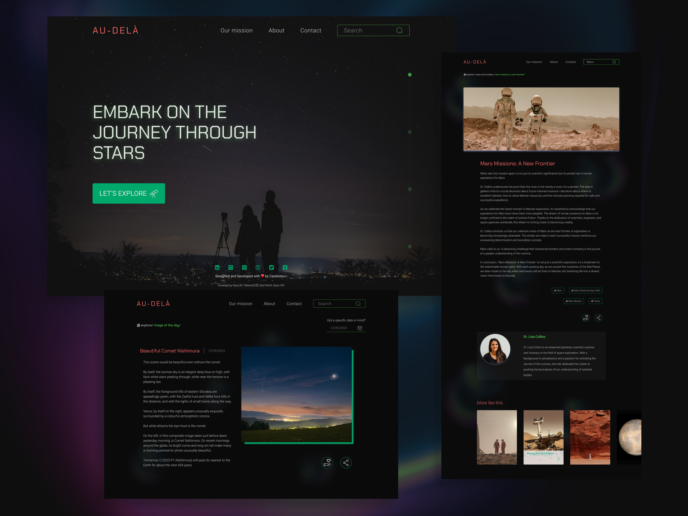

# **Au-Delà (Beyond) Project** 🌟

## **About Me** 👋

Hello, I'm Rudi, the one-person show behind the "Au-Delà" project. This app has been my side project while I'm in between jobs, helping me keep my frontend skills sharp.

I'm currently on the lookout for a new gig, and this project showcases my passion for frontend development. I've done it all myself, from the design to the coding. It's a labor of love and a reflection of my dedication to constant self-improvement.

## **Project Highlights** 🚀

- **Seamless Sharing:** Easily share content from the app.
- **Immersive Micro-Interactions:** Packed with cool micro-interactions to enhance user experience.
- **Robust Search Functionality:** Find what you're looking for effortlessly.
- **Diverse Content Repository:** From articles to images, "Au-Delà" has it all.
- **Optimized Animations:** Smooth animations that keep things running fast.

## **Development Excellence** 🌈

- **Neat and Consistent Design:** The app looks good and is easy to use.
- **Minimal Dependencies:** I've kept things simple with just five essential components.
- **Optimized Performance:** It's been optimized for top-notch performance.

## **Upcoming Enhancements** 🛠️

What's next? Big plans:

- **Tag-Based Search:** Making it even easier to find content.
- **Additional Filters:** More ways to refine your search.
- **Vast API Scope:** I'm expanding thanks to an API with a half million entries – images, articles, and more.

## **Get in Touch** 📬

I'm on the hunt for new opportunities. Let's connect on [LinkedIn](https://www.linkedin.com/in/rudvl/) or check out my design work on [Dribbble](https://dribbble.com/catalysteu-r). Whether it's about job prospects or just chatting about frontend, I'm all ears!
